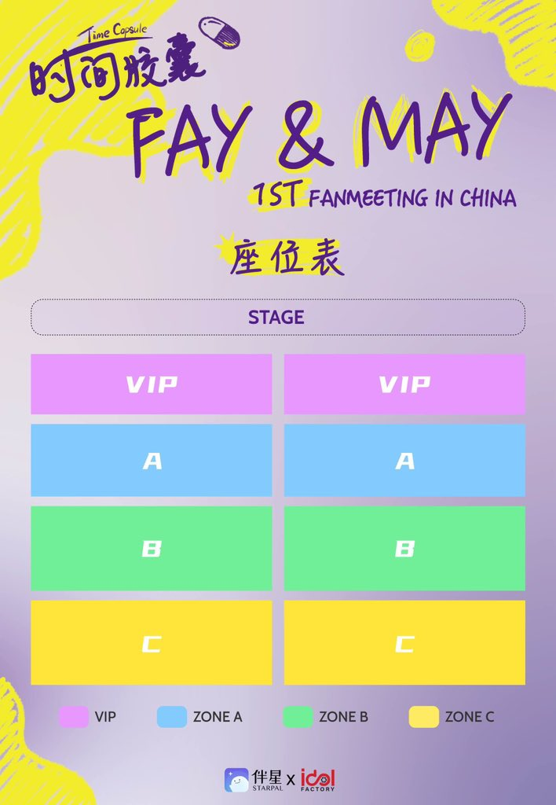
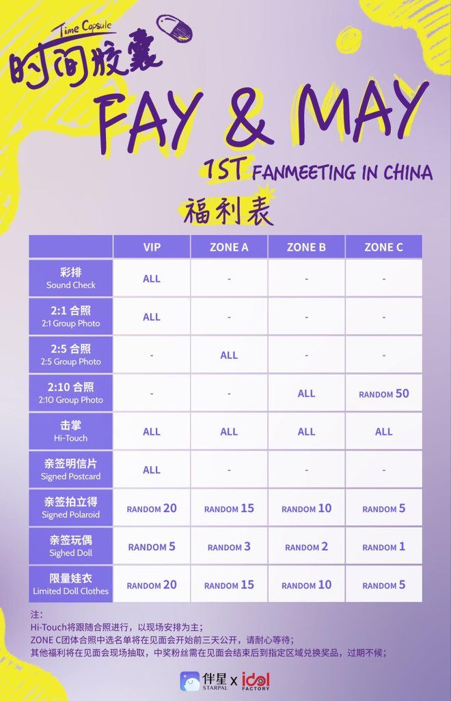
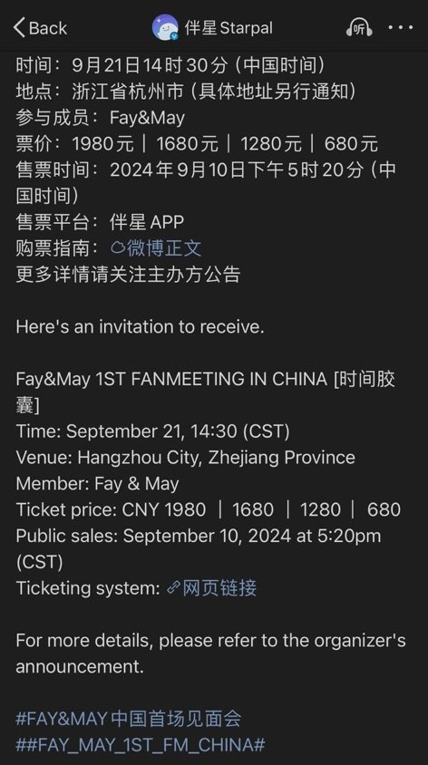

<!-- Main -->

    <section id="one">
        

            <header class="major">
                <h2>{{ site.translations[site.lang].official_events.title }}</h2>
            </header>
            
{{ site.translations[site.lang].official_events.description }}

        

    </section>
    <section id="two" class="spotlights">
        <section>
            

                

                    <button type="button" class="carousel-arrow carousel-prev">&lt;</button>
                    

                        

                            
                        

                        

                            
                        

                        

                            
                        

                        

                            
                        

                    

                    <button type="button" class="carousel-arrow carousel-next">&gt;</button>
                

            

            

                

                    <header class="major">
                        <h3>{{ site.translations[site.lang].official_events.fanmeeting.title }}</h3>
                    </header>
                    
{{ site.translations[site.lang].official_events.fanmeeting.description }} <strong>{{ site.translations[site.lang].official_events.fanmeeting.date }}</strong> {{ site.translations[site.lang].official_events.fanmeeting.details }} <a href="https://x.com/Gackyccc_/status/1832246066714177725">{{ site.translations[site.lang].official_events.fanmeeting.check_post }}</a>

                    
{{ site.translations[site.lang].official_events.fanmeeting.purchase_ticket }} <a href="https://www.nihuo.tech/">{{ site.translations[site.lang].official_events.fanmeeting.purchase_link }}</a>

                

            

        </section>
    </section>

